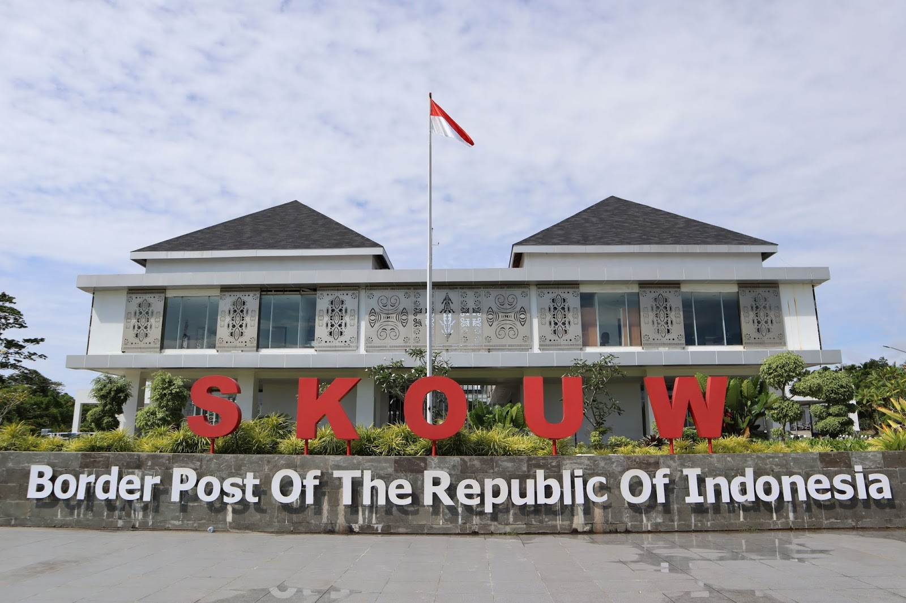
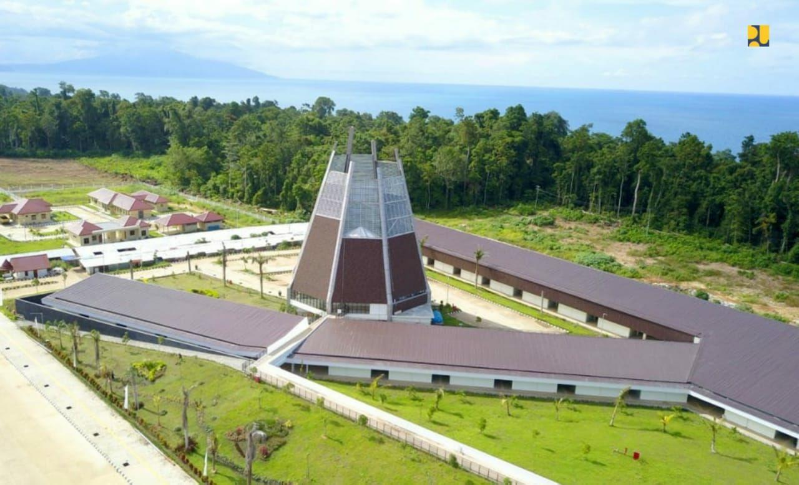

<!DOCTYPE html>
<html lang="en">
<head>
    <meta charset="UTF-8">
    <meta name="viewport" content="width=device-width, initial-scale=1.0">
    <title>Warisan Budaya</title>
    <link rel="stylesheet" type="text/css" href="style.css"><link rel="stylesheet" href="">
</head>
<body>
    

        

            <h1 class="judul">Warisan Budaya</h1>
            

            

                <h2>Tarian budaya papua </h2>
                
ditulis oleh <a href="#">Warisan Budaya</a>pada 1 April 2024

                
 Tarian di Papua Barat Daya, seperti di wilayah lain di Papua, merupakan ekspresi budaya yang kaya dan mendalam, mencerminkan kehidupan sehari-hari, tradisi, serta kepercayaan dan nilai masyarakat setempat. Salah satu tarian tradisional yang terkenal dari Papua Barat Daya adalah tarian "Yospan".
                   

                
                
Nama: Tarian ini dikenal dengan nama "Yospan" atau sering juga disebut "Yosim Pancar". "Yospan" berasal dari kata dalam bahasa Biak, salah satu bahasa yang banyak digunakan di wilayah Papua Barat Daya.

                
                
Gaya dan Gerakan: Tarian Yospan ditampilkan dengan gerakan yang kuat, dinamis, dan energik. Para penari biasanya mengenakan pakaian tradisional yang cerah dan menarik, serta hiasan kepala yang mencolok. Gerakan-gerakan tarian ini sering kali melibatkan langkah-langkah kaki yang cepat, gerakan tangan yang ekspresif, serta gerakan tubuh yang lincah dan ritmis.

                 
                
Musik dan Instrumen: Tarian Yospan biasanya diiringi oleh musik tradisional Papua, termasuk alat musik seperti tifa (gendang), kundu (gendang berukuran besar), seruling, dan terompet bambu. Ritme yang kuat dan energik dari musiknya memberikan dorongan tambahan bagi para penari untuk mengekspresikan diri dengan semangat yang tinggi.
   
                
                
Makna dan Konteks: Tarian Yospan sering kali dijadikan sebagai bagian dari berbagai acara adat dan perayaan masyarakat Papua Barat Daya, seperti pernikahan, pesta panen, atau upacara keagamaan. Tarian ini tidak hanya merupakan bentuk hiburan, tetapi juga memiliki makna mendalam dalam konteks budaya dan spiritual masyarakat setempat.

                
                
Penghargaan dan Pemeliharaan: Meskipun tarian Yospan masih terus dipertahankan dan dipentaskan oleh masyarakat Papua Barat Daya, namun demikian, seperti banyak aspek budaya tradisional lainnya, tarian ini juga menghadapi tantangan dalam hal pemeliharaan dan pelestariannya. Upaya untuk menghargai dan memelihara warisan budaya seperti Yospan menjadi penting untuk menjaga keberlanjutan budaya dan identitas masyarakat Papua Barat Daya.

                
                
Tarian Yospan adalah contoh yang indah dari warisan budaya yang kaya dan hidup di Papua Barat Daya, dan menjadi salah satu cara yang paling kuat untuk menyampaikan dan merayakan identitas budaya yang unik dan beragam dari masyarakat setempat.

                

            
  
            

            
Copyright since 2024

            
      
        

    

</body>
</html> 
